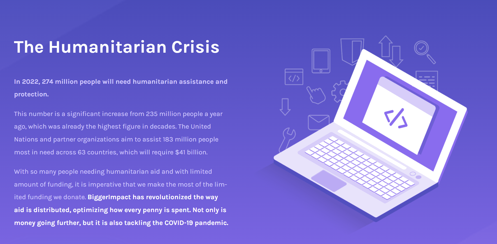
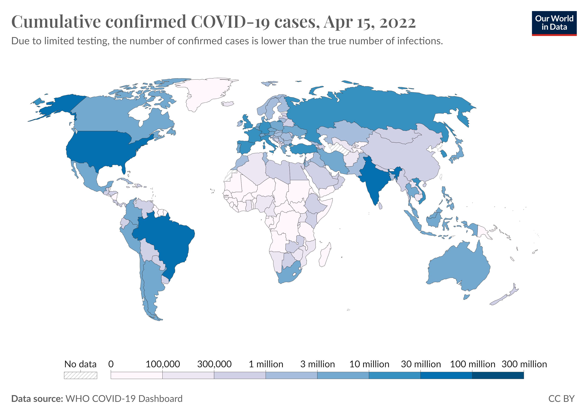
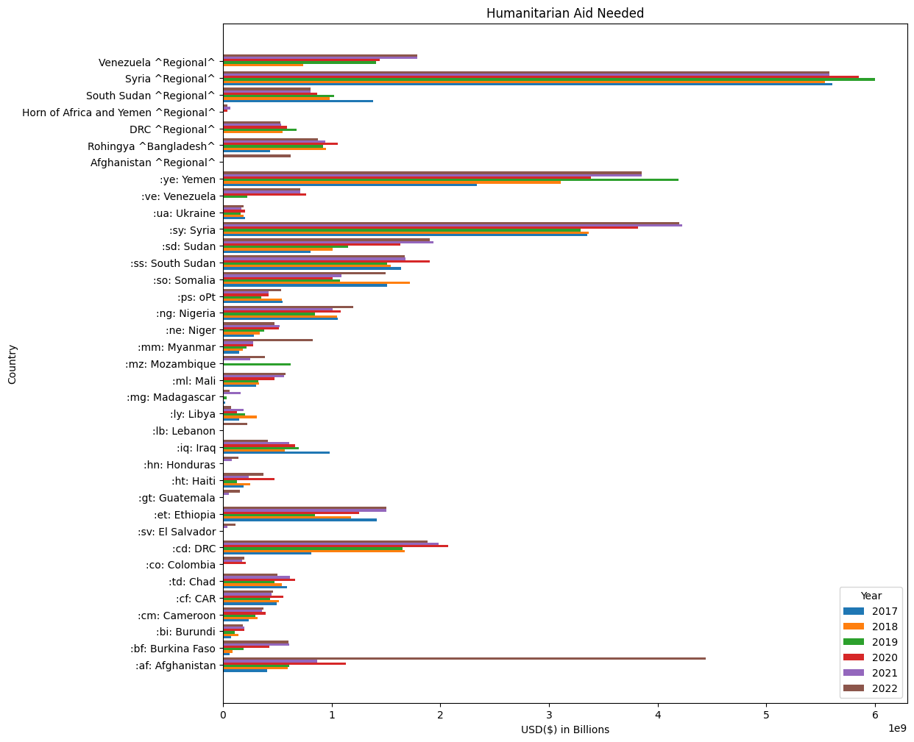
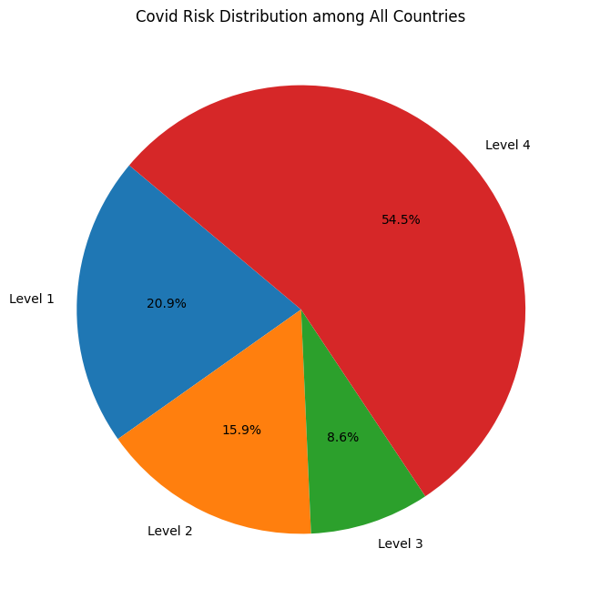
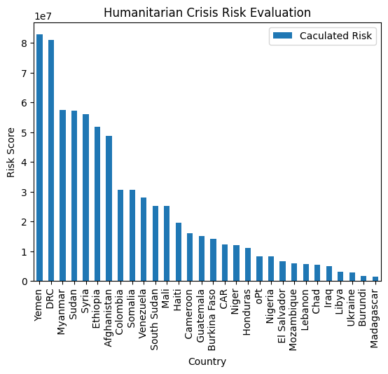

# humanitarian-aid-priority
This project contains the recommendation of how humanitarian aid should be prioritized in its distribution by using a data-driven approach. More specifically, an analysis was conducted on different countries, their populations, as well as their vulnerability towards Covid-19. For reference, this was made on April 14th, 2022.

