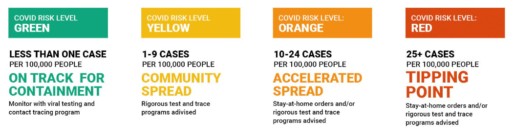
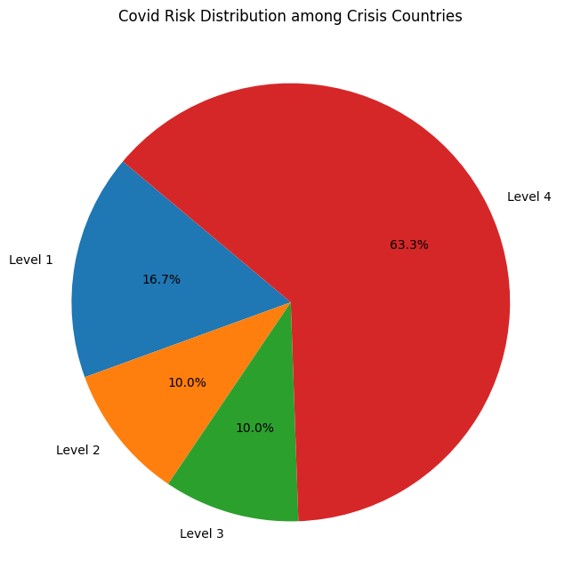

# humanitarian-aid-priority
This project contains the recommendation of how humanitarian aid should be prioritized in its distribution by using a data-driven approach. More specifically, an analysis was conducted on different countries, their populations, as well as their vulnerability towards Covid-19. For reference, this was made on April 14th, 2022.

# Mission Statement

  

# Cumulative Covid-19 Cases (April 2022)

  

# Humanitarian Aid Needed (2017-2022)

  

# Covid Risk Level Distribution across Countries

On April 14th, 2022, Brown University's School of Public Health[https://globalepidemics.org/key-metrics-for-covid-suppression/] maintained a Covid-19 risk levels dashboard serving as a tool for the public to track the pandemic in real time. As such, they categorized four Covid-19 risk levels to countries based off of the number of new daily Covid-19 cases per 100,000 people.

  

Using the Covid-19 daily case rate average, countries' Covid-19 risk levels were distributed as shown below. Amongst countries facing a humanitarian crisis at the time, the distribution of Covid-19 risk level was even worse.

  <table>
    <tr>
      <td>
        
      </td>
      <td>
        
      </td>
    </tr>
  </table>

# Humanitarian Aid Country Priority Evaluation

A preliminary metric called the 'calculated risk' for which to be able to rank countries on their need for humanitarian aid was computed by multiplying the countries' populations  by their Covid-19 risk level. The reasoning behind doing so was based on the logic that the higher the population in a country facing a humanitarian crisis, the more people could be at risk of not only Covid-19, but also any domestic situation. Furthermore, the higher the Covid-19 risk level, the more dire it is to supress the spread of Covid-19 before it becomes uncontrollable. Using this proposed metric, we propose humanitarian aid be prioritized in its distribution according to the following graphic below.

  

